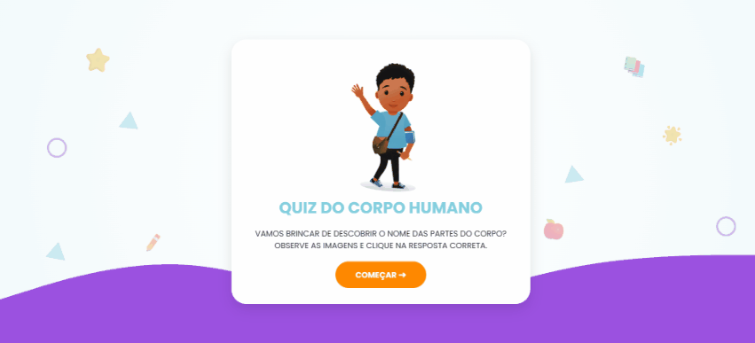
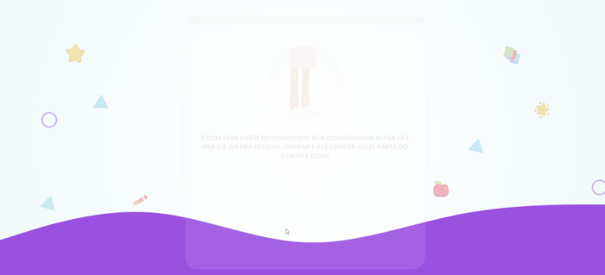
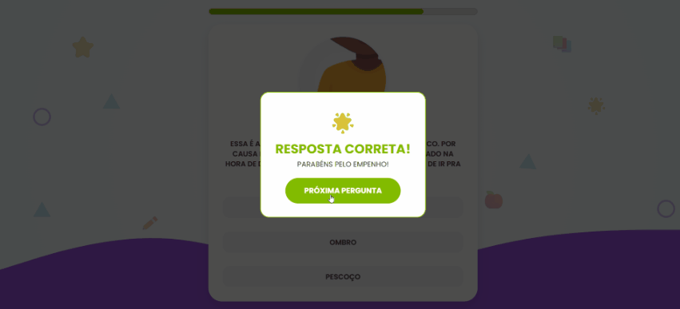
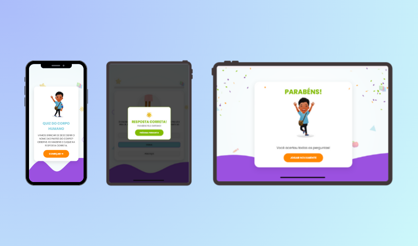

# 🧠🎨 Quiz interativo - Corpo humano

Recurso Educacional Digital (RED) desenvolvido como parte do processo seletivo para a **Aprende Brasil (Grupo Positivo)**, com foco em **educação infantil**, **experiência do usuário (UX)** e **aprendizagem lúdica** para alunos do **1º ano do Ensino Fundamental**.

👉 **[Acesse o Quiz Interativo no GitHub Pages](https://nathaliatg.github.io/corpohumano/)**

Recomendado para visualização em tablets, notebooks ou celulares.

---

## Visão geral do projeto

O quiz interativo é um recurso educacional gamificado que tem como objetivo auxiliar crianças no reconhecimento das partes do corpo humano de forma **visual, interativa e acolhedora**.

O projeto foi pensado a partir de princípios pedagógicos, cognitivos e de UX, respeitando as necessidades de alunos em fase de alfabetização, promovendo **engajamento, autonomia e reforço positivo durante o aprendizado**.

---

## ✅ Atendimento aos requisitos propostos

| Requisito | Aplicação no Projeto |
|---------|---------------------|
| Escolha de um recurso educacional | Quiz interativo com suporte visual e gamificação |
| Layout instigante | Interface lúdica, colorida e imersiva |
| Ousadia na apresentação | Microinterações, animações e feedbacks visuais |
| Responsividade | Metodologia Mobile-First |
| Usabilidade e UX | Design centrado na criança (1º ano) |
| Uso de imagens livres | Ilustrações e ícones de bancos gratuitos |
| Tecnologias | HTML5, CSS3 e JavaScript (Vanilla JS) |

---

## 🎯 Público-Alvo

- Crianças do **1º ano do Ensino Fundamental**
- Alunos em fase de alfabetização inicial
- Ambientes educacionais digitais (escola, tablet, computador ou celular)

---

## Tecnologias utilizadas

- **HTML5**: Estrutura semântica
- **CSS3**: Flexbox, Grid, animações e responsividade
- **JavaScript (Vanilla JS)**: Lógica do quiz, feedbacks e interações

A escolha por **Vanilla JS** garante:
- Alta performance
- Carregamento rápido
- Facilidade de manutenção
- Compatibilidade com ambientes escolares

### Recurso educacional: 
Quiz interativo gamificado, com perguntas visuais e respostas clicáveis, incentivando a aprendizagem por meio da experimentação.

---

## 🎨 Interface e Layout (UI)

### Identidade visual
- Uso equilibrado de cores vibrantes para estimular, sem causar fadiga visual

### Ambientação
- Fundo em degradê suave
- Ícones escolares (livros, maçãs, estrelas)
- Formas geométricas flutuantes que criam sensação de movimento e imersão

O resultado é uma interface que remete a **aplicativos educacionais modernos**, mantendo o foco no conteúdo pedagógico.

---

## 🧠 Usabilidade e Experiência do Usuário (UX)

O projeto foi desenvolvido com **design centrado na criança**, considerando aspectos cognitivos, emocionais e motores.
- **Tipografia Poppins**: alta legibilidade para alunos em fase de alfabetização
- **Botões grandes e claros**: facilitam a interação e reduzem erros
- **Affordance visual**: elementos “convidam” ao clique

### 🧩 Controle da carga cognitiva
- As alternativas de resposta surgem em **efeito cascata**
- Direciona o olhar da criança
- Evita excesso de informações simultâneas

### 💬 Feedback e Reforço Positivo
- Cores acolhedoras para erros e acertos
- Incentivo à nova tentativa
- Manutenção da autoestima do aluno

---

## 🎮 Gamificação e Engajamento

- 🎉 Animações de comemoração ao acertar
- 🎊 Chuva de confetes ao finalizar o quiz
- 📊 Barra de progresso visual que mostra o avanço da atividade, um indicador visual claro que reduz a ansiedade, mostrando quanto falta para concluir a missão.

Esses elementos transformam o aprendizado em uma **experiência emocionalmente positiva**, estimulando a motivação intrínseca da criança.

---

## 📱 Responsividade

O projeto segue a metodologia **Mobile-First**, garantindo uma experiência consistente em:

- Smartphones
- Tablets escolares
- Desktops

Em telas menores, os elementos decorativos se reorganizam para moldar o conteúdo principal, mantendo usabilidade e clareza visual.

---

## 🖼️ Recursos visuais

- Ilustrações e ícones de **bancos gratuitos**
- Conformidade com direitos autorais
- Estética profissional e educativa

---

## Considerações finais

Este Recurso Educacional Digital foi pensado não apenas como um produto técnico, mas como uma **ferramenta pedagógica**, que une:

- Tecnologia
- UX aplicado à educação
- Design infantil
- Aprendizagem significativa

O projeto reflete os valores da **Aprende Brasil e do Grupo Positivo**, priorizando inovação, educação de qualidade e foco no aluno.

